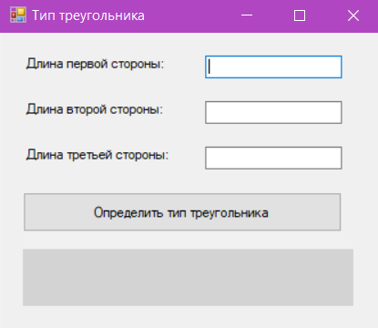

# Проект "Определитель типа треугольника" 📐


---

## 📋 Описание проекта

> **Программа с графическим интерфейсом**, которая принимает длины сторон треугольника и определяет его тип: **равносторонний**, **равнобедренный** или **разносторонний**.

Данное приложение разработано на **C#** с использованием **Windows Forms**. Оно позволяет пользователю ввести три числа (длины сторон треугольника) и после нажатия кнопки получает результат о типе треугольника.

---

## ✨ Возможности программы

- ✅ **Ввод сторон** – три текстовых поля для ввода длин сторон
- ✅ **Валидация ввода** – проверка на пустые поля, некорректные символы и отрицательные числа
- ✅ **Проверка существования треугольника** – на основе неравенства треугольника
- ✅ **Определение типа**:
  - *Равносторонний* – все три стороны равны
  - *Равнобедренный* – две стороны равны
  - *Разносторонний* – все стороны разные
- ✅ **Визуальная обратная связь** – цветовая индикация результата
- ✅ **Обработка погрешностей** – использование `Epsilon` для сравнения чисел с плавающей точкой

---

## 🖼️ Интерфейс программы



---

## 📊 Примеры работы

| Входные данные (стороны) | Результат | Цвет индикации |
|--------------------------|-----------|----------------|
| 5, 5, 5                  | равносторонний | Светло-зеленый |
| 5, 5, 8                  | равнобедренный | Светло-зеленый |
| 3, 4, 5                  | разносторонний | Светло-зеленый |
| 1, 1, 3                  | Треугольник не существует! | Светло-красный |
| 0, 5, 5                  | Ошибка: длина должна быть > 0 | Сообщение |
| ab, 5, 5                 | Ошибка: введите число | Сообщение |

---

## 🚀 Установка и запуск

### Требования

- Windows 7 / 8 / 10 / 11
- [.NET Framework 4.7.2](https://dotnet.microsoft.com/en-us/download/dotnet-framework) или выше
- Visual Studio 2019/2022 (для разработки)

### Инструкция по запуску

1. **Клонирование репозитория**
   ```bash
   git clone https://github.com/your-repo/triangle-determinant.git

2. **Открытие проекта**

Запустите WindowsFormsAppTriangle.sln в Visual Studio

3. **Сборка проекта**

  ```bash
  dotnet build

5. **Запуск приложения**

  ```bash
  dotnet run

## Структура проекта

WindowsFormsAppTriangle/
├── 📄 Form1.cs              # Основная логика приложения
├── 📄 Form1.Designer.cs     # Дизайн формы (автогенерируемый)
├── 📄 Program.cs            # Точка входа в приложение
├── 📄 README.md             # Документация проекта
└── 📁 bin/                  # Скомпилированные файлы

##  Ключевые фрагменты кода

### Определение типа треугольника

private string DetermineTriangleType(double a, double b, double c)
{
    // Проверка на равносторонний (с учетом погрешности)
    if (Math.Abs(a - b) < Epsilon && Math.Abs(b - c) < Epsilon)
    {
        return "равносторонний";
    }

    // Проверка на равнобедренный
    if (Math.Abs(a - b) < Epsilon || Math.Abs(a - c) < Epsilon || Math.Abs(b - c) < Epsilon)
    {
        return "равнобедренный";
    }

    return "разносторонний";
}

### Проверка существования треугольника

private bool IsTriangleValid(double a, double b, double c)
{
    // Теорема о неравенстве треугольника
    return (a + b > c + Epsilon) && 
           (a + c > b + Epsilon) && 
           (b + c > a + Epsilon);
}

## Полезные ссылки

<Официальная документация C#>
<Windows Forms на Microsoft Learn>
<Теорема о неравенстве треугольника>
